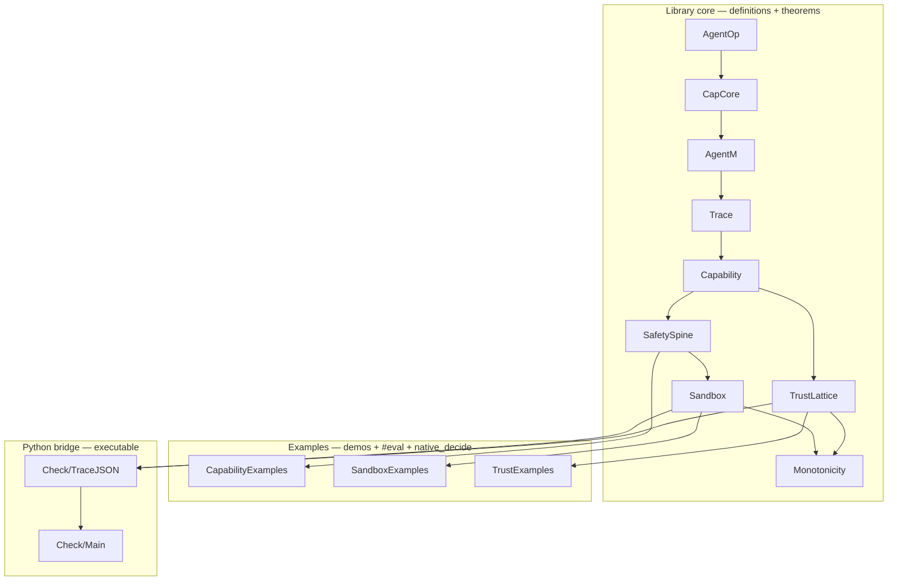

# CAPLean(Capability Access Protocol with Lean) — Proved Capability Envelope for Agentic Coding Pipelines

## What it is
A Lean 4 library that models agentic coding tools as free monads over
a declared operation set, and proves three families of safety theorems
over traces of those monads.

A Python-to-Lean bridge lets you enforce policies at runtime (Python)
and verify traces post-hoc against the same formal definitions the
theorems are proved over (Lean).

## Three layers
| Layer | File | Theorem | What it catches |
|---|---|---|---|
| Capability | `SafetySpine.lean` | `capabilityEnvelope` | Ops outside declared capability |
| Sandbox | `Sandbox.lean` | `sandboxContainment`, `canonicalContainment`, `conservativeContainment`, `certifiedSandboxContainment`, `fullEnvelope` | Effects outside declared path boundary |
| Trust | `TrustLattice.lean` | `trustMonotonicity` | Packages below trust floor |

## Honest scope

**Capability layer (Layer 1)** — enforces containment **by construction**.
`AgentM` is indexed by a `Capability`, and each operation carries a
compile-time proof that it is within scope. Programs containing
out-of-scope ops are rejected by the type checker — no runtime check needed.

**Sandbox layer (Layer 2)** — three tiers of trust for effect containment:

| Tier | Mechanism | Trust assumption |
|---|---|---|
| **Transparent ops** | `canonicalEffects` derives effects structurally from the op (file I/O, network) | None — correctness is definitional |
| **Conservative mode** | `maximalBound sb` assumes opaque ops can do *anything the sandbox allows* | None per-op — the sandbox boundary is the bound |
| **Certified mode** | Custom `OpaqueBound` paired with `RuntimeEnforces` axiom (`CertifiedBound`) | Explicit — the axiom appears in every proof term that depends on it |

File paths are normalized (`.` and `..` resolved) before prefix checking,
so traversal attacks like `/workspace/../../etc/passwd` are rejected.

`fullEnvelope` combines Layer 1 + Layer 2 into a single theorem: an
`AgentM` program is both capability-safe and sandbox-safe.

**Trust layer (Layer 3)** — proves that *if* the declared dependency graph
is accurate, every install meets the trust floor or was explicitly approved.
It does not verify the graph against a live registry.

## Architecture

```
Python side                         Lean side
───────────                         ─────────
capshim.py                          CapLean/ (library + theorems)
  ├─ runtime enforcement              ├─ AgentOp, CapCore, Sandbox, TrustLattice
  ├─ writes trace JSONL                │
  └─ writes config JSON              Check/
                                       ├─ TraceJSON.lean (JSON parsers)
verify_trace.py                        └─ Main.lean (caplean-check binary)
  ├─ Phase A: Python quick check             ▲
  └─ Phase B: calls caplean-check ───────────┘
```

Two files flow from Python to Lean:
- **Trace** (`/tmp/caplean_trace.jsonl`) — one JSON object per op, logged at runtime
- **Config** (`/tmp/caplean_config.json`) — capability, sandbox, and dep graph policy

See [SCHEMA.md](SCHEMA.md) for the full serialization contract.

## Running

```bash
# Prove all theorems (~30s)
lake build

# Build the verified checker binary
lake build caplean-check

# Run the demo agent (generates trace + config)
python demo_agent.py

# Verify the trace (Python quick check + Lean verified check)
python verify_trace.py

# Or call the Lean checker directly
.lake/build/bin/caplean-check
.lake/build/bin/caplean-check --trace /path/to/trace.jsonl --config /path/to/config.json
```

## Python bridge

`capshim.py` provides runtime enforcement and trace logging:

```python
from capshim import Capability, Sandbox, DepEntry, install_shims

cap = Capability(allow_read=True, allow_write=True, allow_exec=False, ...)
sandbox = Sandbox(allowed_paths=["/workspace"])
deps = [DepEntry("requests", "verified")]

install_shims(cap, sandbox=sandbox, dep_graph=deps)
# Now open() and subprocess.run() are intercepted and logged.
# /tmp/caplean_trace.jsonl and /tmp/caplean_config.json are written.
```

For ops the shim can't intercept automatically:
```python
from capshim import log_eval, log_network, log_install, log_approve

log_install("requests")
log_approve("cool-utils")
```

## Cursor integration (MCP)

`caplean_mcp/` ships an MCP server that lets Cursor's agent consult CapLean
Layer 1 before each side-effecting action. Setup, schema, and honest-scope
notes are in [`caplean_mcp/README.md`](caplean_mcp/README.md). The server
writes the same `/tmp/caplean_trace.jsonl` and `/tmp/caplean_config.json`
files that `caplean-check` already certifies, so the post-hoc audit path is
unchanged. Live blocking covers Layer 1 only; Layers 2 and 3 are evaluated
at session end via `caplean.verify_session`.

## Theorem reference

The full API surface of the library — every named theorem, where it lives,
and an abbreviated type signature.

| Theorem | File | Type (abbreviated) |
|---|---|---|
| `capabilityEnvelope` | `SafetySpine.lean` | `(prog : AgentM cap α) → ∀ op ∈ prog.collectTrace, withinScope op cap` |
| `sandboxContainment` | `Sandbox.lean` | `effectTraceContained (traceAnnotatedEffects t ann) sb → ∀ op ∈ t, ∀ eff ∈ ann op, effectWithinSandbox eff sb` |
| `canonicalContainment` | `Sandbox.lean` | specialization of `sandboxContainment` with `ann := canonicalEffects` (no trust assumption) |
| `conservativeContainment` | `Sandbox.lean` | specialization with `ann := fullAnnotation (maximalBound sb)` |
| `certifiedSandboxContainment` | `Sandbox.lean` | as `sandboxContainment` but conclusion also carries `RuntimeEnforces cb.bound` |
| `fullEnvelope` | `Sandbox.lean` | Layer 1 + Layer 2 in one theorem: `(prog : AgentM cap α) → ... → withinScope ∧ effectWithinSandbox` |
| `trustMonotonicity` | `TrustLattice.lean` | `traceInstallsSafeProp t g cap → ∀ installPkg, approved-or-graph-witness` |
| `capabilityMonotonicity` | `Monotonicity.lean` | `CapSubset c1 c2 → traceWithinScope t c1 → traceWithinScope t c2` |
| `traceAppendSafe` | `Monotonicity.lean` | `traceWithinScope t1 cap → traceWithinScope t2 cap → traceWithinScope (t1 ++ t2) cap` |
| `sandboxMonotonicity` | `Monotonicity.lean` | `SandboxSubset sb1 sb2 → effectTraceContained t sb1 → effectTraceContained t sb2` |
| `trustFloorLowering` | `Monotonicity.lean` | lower `cap.minTrust` preserves `traceInstallsSafe` |

## Assumptions and trust boundaries

What is proved unconditionally vs. proved relative to a stated assumption.

- **Proved unconditionally:**
  - `capabilityEnvelope` — by construction of `AgentM`
  - `canonicalContainment` — for transparent ops, `canonicalEffects` is library-defined
  - `traceAppendSafe`, `capabilityMonotonicity`, `sandboxMonotonicity`,
    `trustFloorLowering` — pure structural lemmas
- **Proved relative to `OpaqueBound`:** `sandboxContainment`, `conservativeContainment` —
  the user declares the effects of `evalCode` / `execShell`; the theorem is
  conditional on that declaration being accurate.
- **Proved relative to `RuntimeEnforces`:** `certifiedSandboxContainment` —
  this axiom marks the assertion that a runtime monitor enforces the bound.
  It must be explicitly inhabited in any proof term that uses the theorem.
- **Proved relative to dep graph accuracy:** `trustMonotonicity` — the
  `DepGraph` is the ground truth for transitive trust; CapLean does not
  verify it against a live package registry.
- **Not modeled:** filesystem symlinks, TOCTOU races, kernel-level escapes
  from the host process sandbox, side channels.

## Using CapLean downstream

Add CapLean as a Lake dependency and import it:

```toml
# lakefile.toml
[[require]]
name = "CapLean"
git  = "https://github.com/<owner>/CapLean.git"
```

```lean
-- MyProject.lean
import CapLean

open CapLean

def myCap : Capability where
  allowRead     := true
  allowWrite    := true
  allowExec     := false
  allowEval     := true
  allowNetwork  := false
  allowInstall  := false
  readPrefixes  := ["/workspace"]
  writePrefixes := ["/workspace"]
  minTrust      := .verified

def myAgent : AgentM myCap Unit := do
  op! (.readFile "/workspace/src/main.py")
  op! (.evalCode "pytest.main()")

-- Layer 1 holds by construction:
example : ∀ op ∈ myAgent.collectTrace, withinScope op myCap :=
  capabilityEnvelope myAgent
```

For Layer 2, supply an `EffectAnnotation` (or use `canonicalEffects` /
`maximalBound`) and apply `sandboxContainment`. For Layer 3, declare a
`DepGraph` and apply `trustMonotonicity`.

## Module structure


